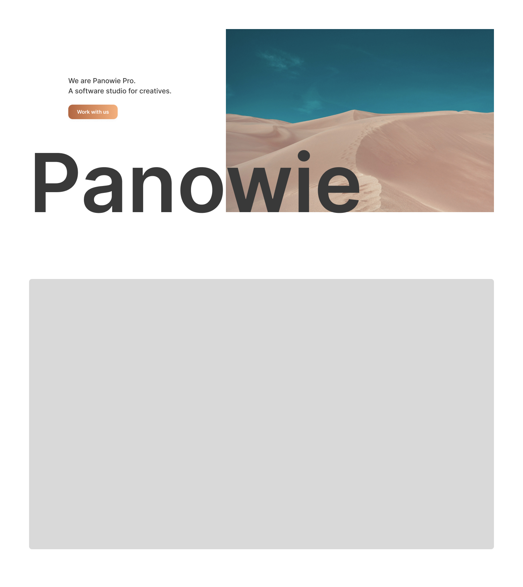

# Parallax Hero

This repository contains a landing page with a simple Hero.

## Deployment

This application is deployed on Vercel. You can access the live deployment [here](https://parallax-hero.vercel.app).

## Getting Started

To run this application locally, follow these steps:

1. Clone this repository to your local machine:

```bash
  git clone https://github.com/energywraith/ParallaxHero.git
```

2. Navigate to the project directory.

3. Install dependencies using yarn:

```bash
  yarn
```

4. Start the application:

```bash
  yarn serve
```

Open [http://localhost:8000](http://localhost:8000) with your browser to see the result.

## Technologies Used

- HTML
- TypeScript
- CSS
- Eslint
- Prettier

## Preview

